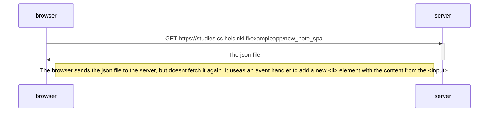

```mermaid
sequenceDiagram
    participant browser
    participant server

    browser->>server: GET   https://studies.cs.helsinki.fi/exampleapp/new_note_spa
    activate server
    server-->>browser: The json file
    deactivate server

    Note right of browser: The browser sends the json file to the server, but doesnt fetch it again. It useas an event handler to add a new <li> element with the content from the <input>.
```